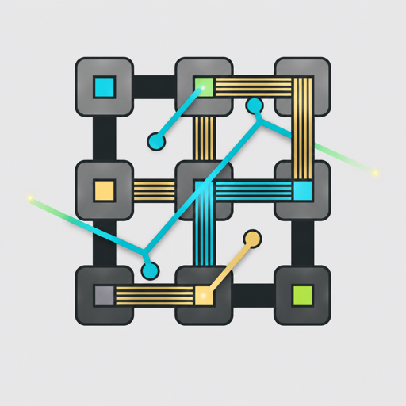

# Heddle

<p align="center">
  
</p>

Rust LLM API harness — tool execution, streaming, edits, context management.

Heddle gives LLMs the ability to read, write, edit, and search files, run shell commands, and maintain persistent conversation sessions. Built on OpenRouter's OpenAI-compatible API with a headless JSON-over-stdio mode for embedding in other applications.

## Quick Start

```bash
cargo build --release

# Add your API key
echo 'OPENROUTER_API_KEY=sk-or-v1-your-key' > .env.local

# Run the interactive CLI
./target/release/heddle
```

The default model is `openrouter/free`. Override it with `HEDDLE_MODEL` or in your config file.

Two binaries are built:

- `heddle` — interactive REPL CLI
- `heddle-headless` — JSON-over-stdio mode (see [docs/headless.md](docs/headless.md))

## Requirements

- A stable Rust toolchain (1.75+ recommended)
- An [OpenRouter](https://openrouter.ai) API key

## Configuration

Heddle uses layered TOML configuration: **defaults -> global -> local -> env vars** (last wins).

### Config Files

| Location | Purpose |
|----------|---------|
| `~/.heddle/config.toml` | Global user settings |
| `.heddle/config.toml` | Project-specific overrides |

```toml
# ~/.heddle/config.toml
model = "anthropic/claude-sonnet-4"
weak_model = "openrouter/free"
api_key = "sk-or-v1-..."
system_prompt = "You are a helpful coding assistant."
approval_mode = "suggest"
temperature = 0.7
max_tokens = 128000
```

### Config Fields

| Field | Type | Default | Description |
|-------|------|---------|-------------|
| `model` | string | `openrouter/free` | Primary LLM model |
| `weak_model` | string | — | Weak model for context compaction |
| `editor_model` | string | — | Specialized editing model |
| `api_key` | string | — | OpenRouter API key |
| `base_url` | string | — | Custom API endpoint |
| `max_tokens` | number | — | Token limit |
| `temperature` | number | — | Generation temperature |
| `system_prompt` | string | — | Custom system prompt |
| `approval_mode` | string | — | Permission mode (see [Permissions](#permissions)) |
| `instructions` | string[] | — | Additional instruction files to inject |
| `tools` | string[] | — | Allowlist of tools to enable |
| `web_fetch_allow_private_addresses` | boolean | false | Allow `web_fetch` to access localhost/private IPs for trusted local workflows |
| `doom_loop_threshold` | number | 3 | Identical tool call iterations before stopping |
| `budget_limit` | number | — | Cost limit for session |
| `compact_trigger` | number | 0.80 | Context usage ratio that triggers compaction |
| `prune_protect` | number | 40000 | Token window protected from pruning |
| `prune_minimum` | number | 4 | Minimum messages before compaction runs |
| `compact_buffer` | number | 0.50 | Target context usage after compaction |

### Feature Flags

Feature flags control which capabilities are active. Override them in the `[features]` section of your config:

```toml
[features]
history = false
file_history = false
```

| Flag | Default (interactive) | Description |
|------|----------------------|-------------|
| `history` | true | Cross-session message history |
| `usage_data` | true | Token usage tracking |
| `facets` | true | Contextual features |
| `file_history` | true | Backup files before write/edit |
| `paste_cache` | true | Paste caching |
| `status_line` | true | Status line display |
| `hooks` | true | Hook execution |
| `tasks` | true | Task tracking |

Feature defaults vary by execution mode — see [Execution Modes](#execution-modes).

### Environment Variables

All config fields have env var overrides:

| Variable | Overrides |
|----------|-----------|
| `HEDDLE_MODEL` | `model` |
| `OPENROUTER_API_KEY` | `api_key` |
| `HEDDLE_BASE_URL` | `base_url` |
| `HEDDLE_MAX_TOKENS` | `max_tokens` |
| `HEDDLE_TEMPERATURE` | `temperature` |
| `HEDDLE_WEAK_MODEL` | `weak_model` |
| `HEDDLE_APPROVAL_MODE` | `approval_mode` |
| `HEDDLE_TOOLS` | `tools` (comma-separated) |
| `HEDDLE_WEB_FETCH_ALLOW_PRIVATE_ADDRESSES` | `web_fetch_allow_private_addresses` |
| `HEDDLE_HOME` | Global config directory (default `~/.heddle`) |

## CLI Usage

Start the interactive CLI with `cargo run --release --bin heddle` (or `./target/release/heddle` after building). Type messages to chat with the agent.

### Slash Commands

| Command | Description |
|---------|-------------|
| `/help` | List available commands |
| `/clear` | Clear conversation context |
| `/exit`, `/quit` | Exit heddle |
| `/cost` | Show token usage and cost |
| `/status` | Show session status |
| `/context` | Show context size estimate and known model limit |
| `/models [query]` | List matching OpenRouter models with price/context metadata |
| `/model [name]` | Switch model or show current model details |
| `/tools` | List available tools |
| `/history [--limit N] [--search term]` | Show message history |
| `/compact` | Force context compaction |
| `/sessions` | List recent sessions |
| `/name <name>` | Name the current session |
| `/fork` | Fork the current session |
| `/restore <file> [version]` | Restore a file from backup |

Model metadata comes from OpenRouter's `/models` registry and is fetched lazily
the first time `/models`, `/model`, or `/context` needs it. If the registry is
unavailable, `/model <id>` warns and falls back to the existing switch behavior
so aliases, provider-native ids, and routed models can still be used. When
OpenRouter reports a different served model, the REPL prints it as
`[model: provider/model-id]`.

### Shell Commands

| Prefix | Behavior |
|--------|----------|
| `!command` | Run shell command, print output (not added to context) |
| `!!command` | Run shell command, print output and inject into agent context |

### Mentions

Reference files with `@` to inject their contents into your message:

```
you> Can you refactor @src/config/loader.rs to use async file reads?
  [injected] src/config/loader.rs (159 lines)
```

## Tools

The agent has access to 9 built-in tools:

| Tool | Category | Description |
|------|----------|-------------|
| `read_file` | read | Read file contents |
| `write_file` | write | Write/overwrite a file (creates parent dirs) |
| `edit_file` | write | Find-and-replace with fuzzy matching fallback |
| `glob` | read | Find files by glob pattern |
| `grep` | read | Search file contents by regex |
| `bash` | execute | Run shell commands |
| `web_fetch` | network | Fetch and extract content from URLs |
| `ask_user` | read | Ask the user a question (interactive only) |
| `save_memory` | write | Save persistent notes to project memory |

Tools can be filtered via the `tools` config field or `HEDDLE_TOOLS` env var.

### Fuzzy Edit Matching

The `edit_file` tool tries 4 match levels when an exact match fails:

1. **Exact** — literal string match
2. **Whitespace-normalized** — collapse runs of whitespace
3. **Indent-flexible** — ignore leading indentation differences
4. **Line-fuzzy** — fuzzy per-line matching

If all levels fail, it reports the closest match with line number.

## Sessions

Sessions are persisted as JSONL files in `~/.heddle/projects/{encoded-path}/sessions/`.

### Resume / Fork a Session

Use `/sessions` to list recent sessions, `/name <name>` to label the current session, and `/fork` to branch the current session into a new one. Session JSONL files are written under `~/.heddle/projects/{encoded-path}/sessions/`; the headless mode can read them back via session APIs.

### Session Commands

- `/sessions` — list recent sessions with message counts and first user message
- `/name my-feature` — name the current session for easy recall
- `/fork` — fork the current session into a new one

## Context Management

Heddle manages context automatically to stay within model limits.

### Pruning

Old tool result messages are replaced with `[pruned — original: N chars]` placeholders. Recent messages within a protection window are preserved. Pruning is automatic after each agent turn.

### Compaction

When context usage exceeds the `compact_trigger` ratio (default 80%), heddle summarizes older messages using the `weak_model` into a `[Context Summary]` anchor message. This preserves key decisions, file paths, and tool outcomes while dramatically reducing token count.

- Automatic: triggers after each agent turn if a `weak_model` is configured
- Manual: use `/compact` to force compaction
- Depth cap: only one level of summarization (existing summaries are included in new ones, not nested)

## Memory

The `save_memory` tool lets the agent persist notes across sessions. Memory is stored as MEMORY.md files:

- **Project memory:** `~/.heddle/projects/{encoded-path}/memory/MEMORY.md`
- **Global memory:** `~/.heddle/memory/MEMORY.md`

Both are automatically loaded into the system prompt at session start (global first, then project).

## File History

Before every `write_file` or `edit_file` operation, heddle backs up the file's current contents. Backups are stored per-project using UUID-based versioning:

```
~/.heddle/projects/{path}/file-history/
  meta.json                    # maps UUID -> file path + version count
  {uuid}/v1.bak               # first backup
  {uuid}/v2.bak               # second backup (after content changed)
```

- Identical content is deduplicated (no new version if hash matches latest)
- Use `/restore <file>` to list available versions
- Use `/restore <file> <version>` to restore a specific version
- Old backups are cleaned up automatically (100MB default limit, oldest first)

## Permissions

The `approval_mode` setting controls which tool categories require user approval:

| Mode | Read | Network | Write | Execute |
|------|------|---------|-------|---------|
| `plan` | allow | allow | deny | deny |
| `suggest` | allow | allow | ask | ask |
| `auto-edit` | allow | allow | allow | ask |
| `full-auto` | allow | allow | allow | allow |
| `yolo` | allow | allow | allow | allow |

**Hardcoded protections** (active in all modes):
- Writing to `.env*` files is always denied
- `rm` commands in bash are always denied

When a tool requires approval, the CLI prompts with `[y/n/always]`. Choosing "always" approves that tool for the rest of the session.

## AGENTS.md

Heddle loads `AGENTS.md` files by walking up from the working directory to the home directory, plus `~/.heddle/AGENTS.md`. Files are concatenated farthest-first into the system prompt, so project-level instructions take precedence.

## Execution Modes

| Mode | Entry Point | Feature Defaults |
|------|-------------|------------------|
| **Interactive** | `heddle` | All features enabled |
| **Non-interactive** | `heddle` with piped stdin | history=off, statusLine=off |
| **Headless** | `heddle-headless` | history=off, facets=off, statusLine=off, pasteCache=off |

See [docs/headless.md](docs/headless.md) for the headless JSON-over-stdio protocol.

## Architecture

```
src/
  types.rs          # Core message/tool types
  bin/              # heddle (CLI) and heddle-headless entry points
  config/           # TOML config loading, paths, feature flags
  provider/         # LLM API client (OpenRouter)
  agent/            # Agent loop (streaming + non-streaming)
  tools/            # Tool implementations + registry
  session/          # JSONL session persistence, resume, fork
  context/          # Pruning + compaction
  memory/           # Agent memory loader
  file_history/     # File backup, restore, cleanup
  history/          # Cross-session message history
  commands/         # Slash command framework
  permissions/      # Tool approval + permission checking
  cost/             # Token cost tracking + pricing
  cli/              # Interactive REPL (rustyline)
  headless/         # JSON-over-stdio adapter
  ipc/              # IPC types, codec, protocol versioning
  agents/           # Agent persona loading
  plans/            # Plan storage
  tasks/            # Task storage
  usage/            # Usage collector
  hooks/            # Pre/post-tool and prompt hooks
```

**Agent loop:** Send messages to the LLM. If it responds with tool calls, execute them, append results, and send again. Repeat until the LLM responds with text only. Both streaming (`run_agent_loop_streaming`) and non-streaming (`run_agent_loop`) variants live in `agent::loop_`.

**Types:** Message, tool, and IPC types are `serde`-derived structs in `src/types.rs` and `src/ipc/types.rs`. Tool parameter schemas are JSON values (OpenAI function format) stored on each `HeddleTool`.

## Development

Build, test, lint, and contributor docs live in [DEVELOPMENT.md](DEVELOPMENT.md). Quick recap:

```bash
cargo build --release        # both bins
cargo test                   # 834 tests
cargo clippy --all-targets   # 0 warnings required
```

Integration tests against the real OpenRouter API are env-gated — see [DEVELOPMENT.md](DEVELOPMENT.md#integration--live-model-tests).

## Dependencies

- **[tokio](https://tokio.rs)** — async runtime
- **[reqwest](https://docs.rs/reqwest)** — HTTP client (rustls)
- **[serde](https://serde.rs) / serde_json / toml / serde_yaml** — serialization
- **[rustyline](https://docs.rs/rustyline)** — interactive line editor for the REPL
- **[dotenvy](https://docs.rs/dotenvy)** — `.env` loading
- **[wiremock](https://docs.rs/wiremock)** (dev) — HTTP mocking for provider tests

## License

MIT
